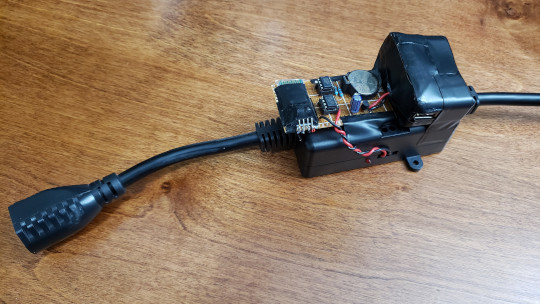
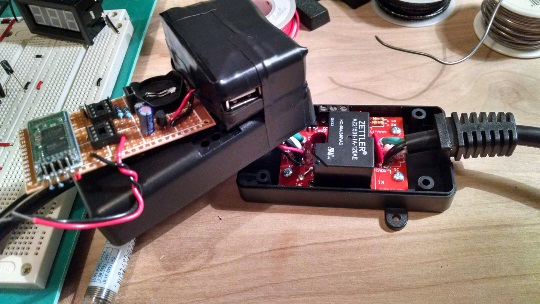
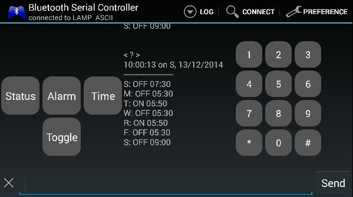
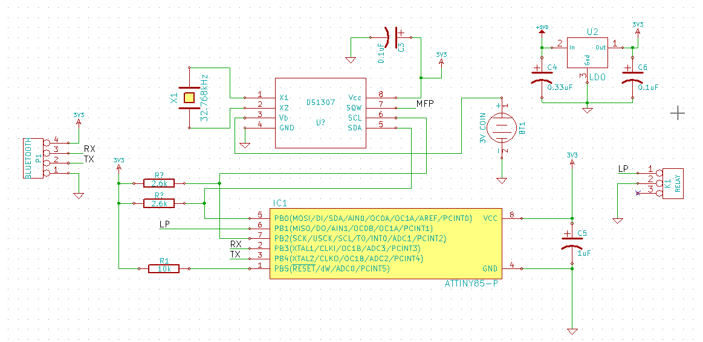

# RTC Relay Project

Bluetooth-controlled time-keeping mains-powered relay switch

## Overview

This microcontroller-based project provides bluetooth control to a mains relay, with an onboard real time clock (RTC) which tracks the given time and day of week, such that user-defined 'alarms' switch the relay on corresponding to that time on any given day of week.



The basis of the design is Adafruit's [Powerswitch Tail 2](https://www.adafruit.com/product/268), a self-contained 1800W mains-rated relay with opto-isolated logic-level control. Attached custom electronics consist of soldered perfboard and a cannibalized 5V wallplug adapter to power them.



An AVR ATTiny85 microcontroller executes the code, written using the Arduino framework and associated libraries. Bluetooth connection is acocmplished using the common [HC-06 module](https://www.amazon.com/s?k=hc-06), and the timed 'alarm' settings are saved past poweroff on the Maxim [DS1307 RTC](https://www.digikey.com/en/ptm/m/maxim-integrated/ds1307-real-time-clocks) chip, which also keeps time during poweroff using a 3V coincell battery.

The user connects to the device via terminal using any UART-compatible bluetooth connection at 19200 baud, and controls it using alphanumeric input:

```
! - toggle relay
? - check status
t - set time
a - set alarm
```

The status check command provides a readout of current time and all alarms per day of week, whether on or off.



Individual alarms may be switched on or off, or set to a different time using the alarm command. Current time may be set in the same sequence using the time command.

## Code

The code loops continually checking for user input from the Bluetooth module. In the absence of immediate pending user request, every five seconds the present time is checked against 'alarms' recorded for the present day of week, triggering the relay if true. Without user intervention, the relay will be switched off one hour after such a trigger.

```cpp
  if (mySerial.available()) {
    processRequest();
  } else if (cnt >= 20) {
    cnt = 0;
    checkAlarm();
  } else {
    cnt++;
  }
  delay(250);
```
Incomplete user input will timeout after approximately 40 seconds, resetting to the main loop.

The code is provided as a single Arduino source file, and relies on the following external libraries:


- [Time.h](https://github.com/PaulStoffregen/Time)
- [SoftwareSerial.h](https://github.com/arduino/ArduinoCore-avr/tree/master/libraries/SoftwareSerial)
- [TinyWireM.h](https://github.com/adafruit/TinyWireM)
- [USI_TWI_Master.h](https://github.com/digistump/DigisparkArduinoIntegration/blob/master/libraries/TinyWireM_Digispark/USI_TWI_Master.h)
- [DS1307RTC_Tiny.h](https://github.com/PaulStoffregen/DS1307RTC)


## Schematic

Simple schematic of the custom electronics is available as drawn up in KiCad. CAD files are included, though may require compatibility updates for more recent versions of KiCad software.



## License

MIT © 2014 John Greenwell